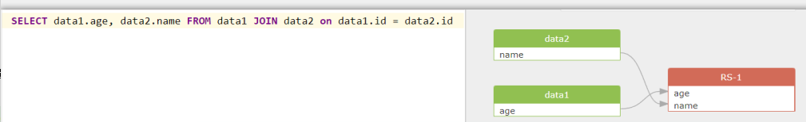
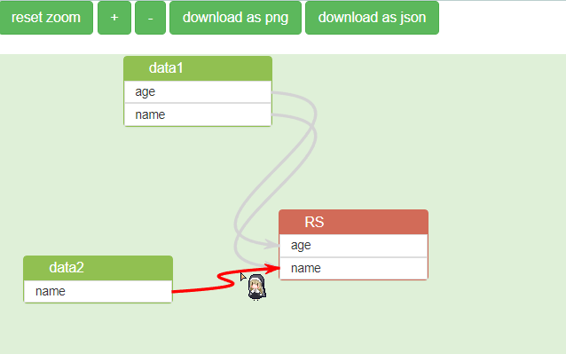

# 基于jsPlumb的、模仿sqlFlow前端的数据血缘前端展示页面
使用的 jsPlumb.js 版本是Community Edition社区版 1.7.6

2022-02-14 15:15:35
基于Vue2版本的已开源，地址：https://github.com/mizuhokaga-dataLineage/jsplumb-dataLineage-vue
## 需求：
后端给定sql的数据血缘json信息，**前端需要实现类似sqlFlow的表和列的连线展示数据血缘关系**。下图是sqlflow的示例图

## 展示：

### 已完成功能
- 缩放「css的scala属性」
- 流程图下载保存为图片「使用html2cavans.js实现」
- 流程图下载保存为json文件「暂时做法是直接下载后端传递的json」
- 画布拖动(使用鼠标右键拖动，这个功能写得挺烂的)
- 鼠标移动到了连接线上后，线两端连接的表的列高亮「jsplumb绑定连线的mouseout和mouseover事件」
### 待实现功能

- 小地图导航
****
## 如何使用：
1. 对`index.js`的`main()`修改,注释请求接口的代码改用本地json数据
```javascript
 function main() {
        jsPlumb.setContainer('bg');

        // 使用后端接口血缘json
        // $.get(requestURL, function (res, status) {
        //     if (status === "success") {
        //         jsonData = res;
        //         DataDraw.draw(jsonData)
        //     }
        // }, 'json');
    
        // 或使用本地数据
        DataDraw.draw(json);
    }
```
2. 在浏览器中打开index.html即可
3. 详细代码解析和一些**坑坑坑**还可以参考我的这篇文章👉 https://blog.csdn.net/qq_44831907/article/details/120937608
## BUG：
1. json数据中的node的id和name两个字段不能是 id.table1 这种带 "."的形式（准确地说纯数字、带其他特殊符号），否则会引起报错！

***
## 碎碎念
参考 
- https://github.com/wangduanduan/visual-ivr 
- http://jsfiddle.net/rayflex/La9p4/

这些项目写的！本项目只实现了根据json渲染图表的功能，其他功能如删除表和连线由于业务不需要**没有编写或保留**。

由于本人写前端时间不多并且有些代码写法是根据业务来写的，一些奇怪的写法不要在意！欢迎提issues！

其中：
- config.js :放置jsPlumb.js全局配置信息
- json.js :放置案例json数据
- index.js :完成渲染绘制的核心js

非常感谢 [katherineOne](https://github.com/katherineOne) 和 [yesky12](https://github.com/yesky12) 的宝贵建议和帮助！
